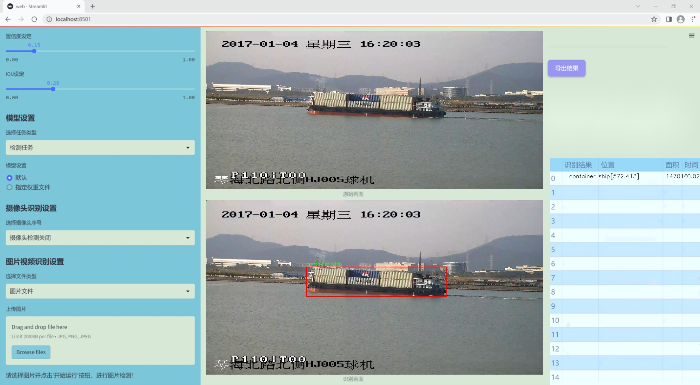

# 改进yolo11-ASF-DySample等200+全套创新点大全：船舶类型检测系统源码＆数据集全套

### 1.图片效果展示





##### 项目来源 **[人工智能促进会 2024.10.23](https://kdocs.cn/l/cszuIiCKVNis)**

注意：由于项目一直在更新迭代，上面“1.图片效果展示”和“2.视频效果展示”展示的系统图片或者视频可能为老版本，新版本在老版本的基础上升级如下：（实际效果以升级的新版本为准）

  （1）适配了YOLOV11的“目标检测”模型和“实例分割”模型，通过加载相应的权重（.pt）文件即可自适应加载模型。

  （2）支持“图片识别”、“视频识别”、“摄像头实时识别”三种识别模式。

  （3）支持“图片识别”、“视频识别”、“摄像头实时识别”三种识别结果保存导出，解决手动导出（容易卡顿出现爆内存）存在的问题，识别完自动保存结果并导出到tempDir中。

  （4）支持Web前端系统中的标题、背景图等自定义修改。

  另外本项目提供训练的数据集和训练教程,暂不提供权重文件（best.pt）,需要您按照教程进行训练后实现图片演示和Web前端界面演示的效果。

### 2.视频效果展示

[2.1 视频效果展示](https://www.bilibili.com/video/BV1LA1PY4EaM/)

### 3.背景

研究背景与意义

随着全球航运业的迅猛发展，船舶类型的自动检测与识别成为了海洋监测、海洋安全及智能交通系统中的重要研究课题。传统的船舶识别方法往往依赖于人工观察和经验判断，效率低下且易受人为因素影响，难以满足现代化海洋管理的需求。因此，开发一种高效、准确的船舶类型检测系统显得尤为重要。近年来，深度学习技术的飞速发展为目标检测领域带来了新的机遇，尤其是YOLO（You Only Look Once）系列模型在实时目标检测任务中表现出了优异的性能。

本研究旨在基于改进的YOLOv11模型，构建一个高效的船舶类型检测系统。YOLOv11作为YOLO系列的最新版本，结合了多种先进的网络结构和算法优化，具备更高的检测精度和更快的推理速度。通过对YOLOv11的改进，我们将进一步提升其在复杂海洋环境中对船舶类型的识别能力。为此，我们将利用特定的数据集，该数据集包含了多种类型的船舶图像，涵盖了不同的角度、光照条件和背景环境。这些数据的多样性将为模型的训练提供丰富的样本，有助于提高模型的泛化能力。

本项目的意义不仅在于技术层面的创新，更在于其对海洋安全和环境保护的实际应用价值。通过实现高效的船舶类型检测，可以为海洋监管部门提供实时监测数据，帮助其及时识别和处理海洋环境中的潜在威胁。同时，该系统还可应用于智能交通管理、船舶调度等领域，推动海洋经济的可持续发展。因此，基于改进YOLOv11的船舶类型检测系统的研究具有重要的理论价值和实际意义。

### 4.数据集信息展示

##### 4.1 本项目数据集详细数据（类别数＆类别名）

nc: 6
names: ['bulk cargo carrier', 'container ship', 'fishing boat', 'general cargo ship', 'ore carrier', 'passenger ship']


该项目为【目标检测】数据集，请在【训练教程和Web端加载模型教程（第三步）】这一步的时候按照【目标检测】部分的教程来训练

##### 4.2 本项目数据集信息介绍

本项目数据集信息介绍

本项目所使用的数据集名为“boat”，旨在为改进YOLOv11的船舶类型检测系统提供丰富的训练素材。该数据集包含六个主要类别，分别为：散货船、集装箱船、渔船、一般货船、矿石运输船和客船。这些类别涵盖了船舶运输行业的多样性，确保了模型在不同类型船舶识别上的全面性和准确性。

数据集中的图像经过精心挑选和标注，确保每个类别的样本都具有代表性。散货船作为一种常见的货物运输方式，其特征包括宽大的船体和开放的货舱，适合运输大宗货物。集装箱船则以其标准化的集装箱为特点，具有明显的结构特征，适合于全球贸易。渔船的设计则更加多样化，通常较小且灵活，适合在近海或内陆水域作业。一般货船的设计相对通用，能够运输多种类型的货物，而矿石运输船则专门用于大宗矿石的运输，通常具有更大的载重能力。最后，客船则以其舒适性和安全性为主要设计目标，适合于人员运输。

通过使用“boat”数据集，改进后的YOLOv11模型将能够更准确地识别和分类不同类型的船舶，从而提高船舶监测和管理的效率。这一数据集不仅为模型的训练提供了坚实的基础，也为未来在船舶类型检测领域的研究和应用奠定了重要的理论和实践基础。通过不断优化模型的识别能力，我们期望能够在实际应用中实现更高的准确率和更快的检测速度，为船舶行业的智能化发展贡献力量。


### 5.全套项目环境部署视频教程（零基础手把手教学）

[5.1 所需软件PyCharm和Anaconda安装教程（第一步）](https://www.bilibili.com/video/BV1BoC1YCEKi/?spm_id_from=333.999.0.0&vd_source=bc9aec86d164b67a7004b996143742dc)


[5.2 安装Python虚拟环境创建和依赖库安装视频教程（第二步）](https://www.bilibili.com/video/BV1ZoC1YCEBw?spm_id_from=333.788.videopod.sections&vd_source=bc9aec86d164b67a7004b996143742dc)

### 6.改进YOLOv11训练教程和Web_UI前端加载模型教程（零基础手把手教学）

[6.1 改进YOLOv11训练教程和Web_UI前端加载模型教程（第三步）](https://www.bilibili.com/video/BV1BoC1YCEhR?spm_id_from=333.788.videopod.sections&vd_source=bc9aec86d164b67a7004b996143742dc)


按照上面的训练视频教程链接加载项目提供的数据集，运行train.py即可开始训练



     Epoch   gpu_mem       box       obj       cls    labels  img_size
     1/200     20.8G   0.01576   0.01955  0.007536        22      1280: 100%|██████████| 849/849 [14:42<00:00,  1.04s/it]
               Class     Images     Labels          P          R     mAP@.5 mAP@.5:.95: 100%|██████████| 213/213 [01:14<00:00,  2.87it/s]
                 all       3395      17314      0.994      0.957      0.0957      0.0843

     Epoch   gpu_mem       box       obj       cls    labels  img_size
     2/200     20.8G   0.01578   0.01923  0.007006        22      1280: 100%|██████████| 849/849 [14:44<00:00,  1.04s/it]
               Class     Images     Labels          P          R     mAP@.5 mAP@.5:.95: 100%|██████████| 213/213 [01:12<00:00,  2.95it/s]
                 all       3395      17314      0.996      0.956      0.0957      0.0845

     Epoch   gpu_mem       box       obj       cls    labels  img_size
     3/200     20.8G   0.01561    0.0191  0.006895        27      1280: 100%|██████████| 849/849 [10:56<00:00,  1.29it/s]
               Class     Images     Labels          P          R     mAP@.5 mAP@.5:.95: 100%|███████   | 187/213 [00:52<00:00,  4.04it/s]
                 all       3395      17314      0.996      0.957      0.0957      0.0845


###### [项目数据集下载链接](https://kdocs.cn/l/cszuIiCKVNis)

### 7.原始YOLOv11算法讲解

YOLOv11是Ultralytics推出的YOLO系列最新版本，专为实现尖端的物体检测而设计。其架构和训练方法上进行了重大改进，使之不仅具备卓越的准确性和处理速度，还在计算效率上实现了一场革命。得益于其改进的主干和颈部架构，YOLOv11在特征提取和处理复杂任务时表现更加出色。在2024年9月27日，Ultralytics通过长达九小时的在线直播发布这一新作，展示了其在计算机视觉领域的革新。

YOLOv11通过精细的架构设计和优化训练流程，在保持高精度的同时，缩减了参数量，与YOLOv8m相比减少了22%的参数，使其在COCO数据集上的平均准确度（mAP）有所提升。这种效率的提高使YOLOv11非常适合部署在各种硬件环境中，包括边缘设备、云计算平台以及支持NVIDIA GPU的系统，确保在灵活性上的优势。

该模型支持广泛的任务，从对象检测、实例分割到图像分类、姿态估计和定向对象检测（OBB），几乎覆盖了计算机视觉的所有主要挑战。其创新的C3k2和C2PSA模块提升了网络深度和注意力机制的应用，提高了特征提取的效率和效果。同时，YOLOv11的改进网络结构也使之在复杂视觉任务上得以从容应对，成为各类计算机视觉任务的多功能选择。这些特性令YOLOv11在实施实时物体检测的各个领域中表现出众。
* * *

2024年9月27日，Ultralytics在线直播长达九小时，为YOLO11召开“发布会”

YOLO11 是 Ultralytics YOLO 系列实时物体检测器的最新版本，它以尖端的准确性、速度和效率重新定义了可能性。在之前 YOLO
版本的显著进步的基础上，YOLO11 在架构和训练方法方面进行了重大改进，使其成为各种计算机视觉任务的多功能选择。


##### YOLO11主要特点：

  * 增强的特征提取：YOLO11 采用了改进的主干和颈部架构，增强了特征提取能力，可实现更精确的对象检测和复杂任务性能。
  * 针对效率和速度进行了优化：YOLO11 引入了完善的架构设计和优化的训练流程，可提供更快的处理速度，并在准确度和性能之间保持最佳平衡。
  * 更少的参数，更高的准确度：借助模型设计的进步，YOLO11m 在 COCO 数据集上实现了更高的平均准确度 (mAP)，同时使用的参数比 YOLOv8m 少 22%，从而提高了计算效率，同时又不影响准确度。
  * 跨环境的适应性：YOLO11 可以无缝部署在各种环境中，包括边缘设备、云平台和支持 NVIDIA GPU 的系统，从而确保最大的灵活性。
  * 支持的任务范围广泛：无论是对象检测、实例分割、图像分类、姿势估计还是定向对象检测 (OBB)，YOLO11 都旨在满足各种计算机视觉挑战。

##### 支持的任务和模式

YOLO11 以 YOLOv8 中引入的多功能模型系列为基础，为各种计算机视觉任务提供增强的支持：

Model| Filenames| Task| Inference| Validation| Training| Export  
---|---|---|---|---|---|---  
YOLO11| yolol11n.pt, yolol11s.pt, yolol11m.pt, yolol11x.pt| Detection| ✅| ✅|
✅| ✅  
YOLO11-seg| yolol11n-seg.pt, yolol11s-seg.pt, yolol11m-seg.pt,
yolol11x-seg.pt| Instance Segmentation| ✅| ✅| ✅| ✅  
YOLO11-pose| yolol11n-pose.pt, yolol11s-pose.pt, yolol11m-pose.pt,
yolol11x-pose.pt| Pose/Keypoints| ✅| ✅| ✅| ✅  
YOLO11-obb| yolol11n-obb.pt, yolol11s-obb.pt, yolol11m-obb.pt,
yolol11x-obb.pt| Oriented Detection| ✅| ✅| ✅| ✅  
YOLO11-cls| yolol11n-cls.pt, yolol11s-cls.pt, yolol11m-cls.pt,
yolol11x-cls.pt| Classification| ✅| ✅| ✅| ✅  
  
##### 简单的 YOLO11 训练和推理示例

以下示例适用于用于对象检测的 YOLO11 Detect 模型。

    
    
    from ultralytics import YOLO
    
    # Load a model
    model = YOLO("yolo11n.pt")
    
    # Train the model
    train_results = model.train(
        data="coco8.yaml",  # path to dataset YAML
        epochs=100,  # number of training epochs
        imgsz=640,  # training image size
        device="cpu",  # device to run on, i.e. device=0 or device=0,1,2,3 or device=cpu
    )
    
    # Evaluate model performance on the validation set
    metrics = model.val()
    
    # Perform object detection on an image
    results = model("path/to/image.jpg")
    results[0].show()
    
    # Export the model to ONNX format
    path = model.export(format="onnx")  # return path to exported model

##### 支持部署于边缘设备

YOLO11 专为适应各种环境而设计，包括边缘设备。其优化的架构和高效的处理能力使其适合部署在边缘设备、云平台和支持 NVIDIA GPU
的系统上。这种灵活性确保 YOLO11 可用于各种应用，从移动设备上的实时检测到云环境中的复杂分割任务。有关部署选项的更多详细信息，请参阅导出文档。

##### YOLOv11 yaml文件

    
    
    # Ultralytics YOLO 🚀, AGPL-3.0 license
    # YOLO11 object detection model with P3-P5 outputs. For Usage examples see https://docs.ultralytics.com/tasks/detect
    
    # Parameters
    nc: 80 # number of classes
    scales: # model compound scaling constants, i.e. 'model=yolo11n.yaml' will call yolo11.yaml with scale 'n'
      # [depth, width, max_channels]
      n: [0.50, 0.25, 1024] # summary: 319 layers, 2624080 parameters, 2624064 gradients, 6.6 GFLOPs
      s: [0.50, 0.50, 1024] # summary: 319 layers, 9458752 parameters, 9458736 gradients, 21.7 GFLOPs
      m: [0.50, 1.00, 512] # summary: 409 layers, 20114688 parameters, 20114672 gradients, 68.5 GFLOPs
      l: [1.00, 1.00, 512] # summary: 631 layers, 25372160 parameters, 25372144 gradients, 87.6 GFLOPs
      x: [1.00, 1.50, 512] # summary: 631 layers, 56966176 parameters, 56966160 gradients, 196.0 GFLOPs
    
    # YOLO11n backbone
    backbone:
      # [from, repeats, module, args]
      - [-1, 1, Conv, [64, 3, 2]] # 0-P1/2
      - [-1, 1, Conv, [128, 3, 2]] # 1-P2/4
      - [-1, 2, C3k2, [256, False, 0.25]]
      - [-1, 1, Conv, [256, 3, 2]] # 3-P3/8
      - [-1, 2, C3k2, [512, False, 0.25]]
      - [-1, 1, Conv, [512, 3, 2]] # 5-P4/16
      - [-1, 2, C3k2, [512, True]]
      - [-1, 1, Conv, [1024, 3, 2]] # 7-P5/32
      - [-1, 2, C3k2, [1024, True]]
      - [-1, 1, SPPF, [1024, 5]] # 9
      - [-1, 2, C2PSA, [1024]] # 10
    
    # YOLO11n head
    head:
      - [-1, 1, nn.Upsample, [None, 2, "nearest"]]
      - [[-1, 6], 1, Concat, [1]] # cat backbone P4
      - [-1, 2, C3k2, [512, False]] # 13
    
      - [-1, 1, nn.Upsample, [None, 2, "nearest"]]
      - [[-1, 4], 1, Concat, [1]] # cat backbone P3
      - [-1, 2, C3k2, [256, False]] # 16 (P3/8-small)
    
      - [-1, 1, Conv, [256, 3, 2]]
      - [[-1, 13], 1, Concat, [1]] # cat head P4
      - [-1, 2, C3k2, [512, False]] # 19 (P4/16-medium)
    
      - [-1, 1, Conv, [512, 3, 2]]
      - [[-1, 10], 1, Concat, [1]] # cat head P5
      - [-1, 2, C3k2, [1024, True]] # 22 (P5/32-large)
    
      - [[16, 19, 22], 1, Detect, [nc]] # Detect(P3, P4, P5)
    

**YOLO11和YOLOv8 yaml文件的区别**


##### 改进模块代码

  * C3k2 

    
    
    class C3k2(C2f):
        """Faster Implementation of CSP Bottleneck with 2 convolutions."""
    
        def __init__(self, c1, c2, n=1, c3k=False, e=0.5, g=1, shortcut=True):
            """Initializes the C3k2 module, a faster CSP Bottleneck with 2 convolutions and optional C3k blocks."""
            super().__init__(c1, c2, n, shortcut, g, e)
            self.m = nn.ModuleList(
                C3k(self.c, self.c, 2, shortcut, g) if c3k else Bottleneck(self.c, self.c, shortcut, g) for _ in range(n)
            )

C3k2，它是具有两个卷积的CSP（Partial Cross Stage）瓶颈架构的更快实现。

**类继承：**

  * `C3k2`继承自类`C2f`。这表明`C2f`很可能实现了经过修改的基本CSP结构，而`C3k2`进一步优化或修改了此结构。

**构造函数（`__init__`）：**

  * `c1`：输入通道。

  * `c2`：输出通道。

  * `n`：瓶颈层数（默认为1）。

  * `c3k`：一个布尔标志，确定是否使用`C3k`块或常规`Bottleneck`块。

  * `e`：扩展比率，控制隐藏层的宽度（默认为0.5）。

  * `g`：分组卷积的组归一化参数或组数（默认值为 1）。

  * `shortcut`：一个布尔值，用于确定是否在网络中包含快捷方式连接（默认值为 `True`）。

**初始化：**

  * `super().__init__(c1, c2, n, short-cut, g, e)` 调用父类 `C2f` 的构造函数，初始化标准 CSP 组件，如通道数、快捷方式、组等。

**模块列表（`self.m`）：**

  * `nn.ModuleList` 存储 `C3k` 或 `Bottleneck` 模块，具体取决于 `c3k` 的值。

  * 如果 `c3k` 为 `True`，它会初始化 `C3k` 模块。`C3k` 模块接收以下参数：

  * `self.c`：通道数（源自 `C2f`）。

  * `2`：这表示在 `C3k` 块内使用了两个卷积层。

  * `shortcut` 和 `g`：从 `C3k2` 构造函数传递。

  * 如果 `c3k` 为 `False`，则初始化标准 `Bottleneck` 模块。

`for _ in range(n)` 表示将创建 `n` 个这样的块。

**总结：**

  * `C3k2` 实现了 CSP 瓶颈架构，可以选择使用自定义 `C3k` 块（具有两个卷积）或标准 `Bottleneck` 块，具体取决于 `c3k` 标志。

  * C2PSA

    
    
    class C2PSA(nn.Module):
        """
        C2PSA module with attention mechanism for enhanced feature extraction and processing.
    
        This module implements a convolutional block with attention mechanisms to enhance feature extraction and processing
        capabilities. It includes a series of PSABlock modules for self-attention and feed-forward operations.
    
        Attributes:
            c (int): Number of hidden channels.
            cv1 (Conv): 1x1 convolution layer to reduce the number of input channels to 2*c.
            cv2 (Conv): 1x1 convolution layer to reduce the number of output channels to c.
            m (nn.Sequential): Sequential container of PSABlock modules for attention and feed-forward operations.
    
        Methods:
            forward: Performs a forward pass through the C2PSA module, applying attention and feed-forward operations.
    
        Notes:
            This module essentially is the same as PSA module, but refactored to allow stacking more PSABlock modules.
    
        Examples:
            >>> c2psa = C2PSA(c1=256, c2=256, n=3, e=0.5)
            >>> input_tensor = torch.randn(1, 256, 64, 64)
            >>> output_tensor = c2psa(input_tensor)
        """
    
        def __init__(self, c1, c2, n=1, e=0.5):
            """Initializes the C2PSA module with specified input/output channels, number of layers, and expansion ratio."""
            super().__init__()
            assert c1 == c2
            self.c = int(c1 * e)
            self.cv1 = Conv(c1, 2 * self.c, 1, 1)
            self.cv2 = Conv(2 * self.c, c1, 1)
    
            self.m = nn.Sequential(*(PSABlock(self.c, attn_ratio=0.5, num_heads=self.c // 64) for _ in range(n)))
    
        def forward(self, x):
            """Processes the input tensor 'x' through a series of PSA blocks and returns the transformed tensor."""
            a, b = self.cv1(x).split((self.c, self.c), dim=1)
            b = self.m(b)
            return self.cv2(torch.cat((a, b), 1))

`C2PSA` 模块是一个自定义神经网络层，带有注意力机制，用于增强特征提取和处理。

**类概述**

  * **目的：**

  * `C2PSA` 模块引入了一个卷积块，利用注意力机制来改进特征提取和处理。

  * 它使用一系列 `PSABlock` 模块，这些模块可能代表某种形式的位置自注意力 (PSA)，并且该架构旨在允许堆叠多个 `PSABlock` 层。

**构造函数（`__init__`）：**

  * **参数：**

  * `c1`：输入通道（必须等于 `c2`）。

  * `c2`：输出通道（必须等于 `c1`）。

  * `n`：要堆叠的 `PSABlock` 模块数量（默认值为 1）。

  * `e`：扩展比率，用于计算隐藏通道的数量（默认值为 0.5）。

  * **属性：**

  * `self.c`：隐藏通道数，计算为 `int(c1 * e)`。

  * `self.cv1`：一个 `1x1` 卷积，将输入通道数从 `c1` 减少到 `2 * self.c`。这为将输入分成两部分做好准备。

  * `self.cv2`：另一个 `1x1` 卷积，处理后将通道维度恢复回 `c1`。

  * `self.m`：一系列 `PSABlock` 模块。每个 `PSABlock` 接收 `self.c` 通道，注意头的数量为 `self.c // 64`。每个块应用注意和前馈操作。

**前向方法：**

  * **输入：**

  * `x`，输入张量。

  * **操作：**

  1. `self.cv1(x)` 应用 `1x1` 卷积，将输入通道大小从 `c1` 减小到 `2 * self.c`。

  2. 生成的张量沿通道维度分为两部分，`a` 和 `b`。

  * `a`：第一个 `self.c` 通道。

  * `b`：剩余的 `self.c` 通道。

  1. `b` 通过顺序容器 `self.m`，它是 `PSABlock` 模块的堆栈。这部分经过基于注意的处理。

  2. 处理后的张量 `b` 与 `a` 连接。

  3. `self.cv2` 应用 `1x1` 卷积，将通道大小恢复为 `c1`。

  * **输出：**

  * 应用注意和卷积操作后的变换后的张量。

**总结：**

  * **C2PSA** 是一个增强型卷积模块，它通过堆叠的 `PSABlock` 模块应用位置自注意力。它拆分输入张量，将注意力应用于其中一部分，然后重新组合并通过最终卷积对其进行处理。此结构有助于从输入数据中提取复杂特征。

##### 网络结构


### 8.200+种全套改进YOLOV11创新点原理讲解

#### 8.1 200+种全套改进YOLOV11创新点原理讲解大全

由于篇幅限制，每个创新点的具体原理讲解就不全部展开，具体见下列网址中的改进模块对应项目的技术原理博客网址【Blog】（创新点均为模块化搭建，原理适配YOLOv5~YOLOv11等各种版本）

[改进模块技术原理博客【Blog】网址链接](https://gitee.com/qunmasj/good)


#### 8.2 精选部分改进YOLOV11创新点原理讲解

###### 这里节选部分改进创新点展开原理讲解(完整的改进原理见上图和[改进模块技术原理博客链接](https://gitee.com/qunmasj/good)【如果此小节的图加载失败可以通过CSDN或者Github搜索该博客的标题访问原始博客，原始博客图片显示正常】
### CBAM空间注意力机制
近年来，随着深度学习研究方向的火热，注意力机制也被广泛地应用在图像识别、语音识别和自然语言处理等领域，注意力机制在深度学习任务中发挥着举足轻重的作用。注意力机制借鉴于人类的视觉系统，例如，人眼在看到一幅画面时，会倾向于关注画面中的重要信息，而忽略其他可见的信息。深度学习中的注意力机制和人类视觉的注意力机制相似，通过扫描全局数据，从大量数据中选择出需要重点关注的、对当前任务更为重要的信息，然后对这部分信息分配更多的注意力资源，从这些信息中获取更多所需要的细节信息，而抑制其他无用的信息。而在深度学习中，则具体表现为给感兴趣的区域更高的权重，经过网络的学习和调整，得到最优的权重分配，形成网络模型的注意力，使网络拥有更强的学习能力，加快网络的收敛速度。
注意力机制通常可分为软注意力机制和硬注意力机制[4-5]。软注意力机制在选择信息时，不是从输入的信息中只选择1个，而会用到所有输入信息，只是各个信息对应的权重分配不同，然后输入网络模型进行计算;硬注意力机制则是从输入的信息中随机选取一个或者选择概率最高的信息，但是这一步骤通常是不可微的，导致硬注意力机制更难训练。因此，软注意力机制应用更为广泛，按照原理可将软注意力机制划分为:通道注意力机制（channel attention)、空间注意力机制(spatial attention）和混合域注意力机制(mixed attention)。
通道注意力机制的本质建立各个特征通道之间的重要程度，对感兴趣的通道进行重点关注，弱化不感兴趣的通道的作用;空间注意力的本质则是建模了整个空间信息的重要程度，然后对空间内感兴趣的区域进行重点关注，弱化其余非感兴趣区域的作用;混合注意力同时运用了通道注意力和空间注意力，两部分先后进行或并行，形成对通道特征和空间特征同时关注的注意力模型。

卷积层注意力模块(Convolutional Block Attention Module，CBAM）是比较常用的混合注意力模块，其先后集中了通道注意力模块和空间注意力模块，网络中加入该模块能有效提高网络性能，减少网络模型的计算量，模块结构如图所示。输入特征图首先经过分支的通道注意力模块，然后和主干的原特征图融合，得到具有通道注意力的特征图，接着经过分支的空间注意力模块，在和主干的特征图融合后，得到同时具有通道特征注意力和空间特征注意力的特征图。CBAM模块不改变输入特征图的大小，因此该模块是一个“即插即用”的模块，可以插入网络的任何位置。

通道注意力模块的结构示意图如图所示，通道注意力模块分支并行地对输入的特征图进行最大池化操作和平均池化操作，然后利用多层感知机对结果进行变换，得到应用于两个通道的变换结果，最后经过sigmoid激活函数将变换结果融合，得到具有通道注意力的通道特征图。

空间注意力模块示意图如图所示，将通道注意力模块输出的特征图作为该模块的输入特征图，首先对输入特征图进行基于通道的最大池化操作和平均池化操作，将两部分得到的结果拼接起来，然后通过卷积得到降为Ⅰ通道的特征图，最后通过sigmoid激活函数生成具有空间注意力的特征图。


### 9.系统功能展示

图9.1.系统支持检测结果表格显示

  图9.2.系统支持置信度和IOU阈值手动调节

  图9.3.系统支持自定义加载权重文件best.pt(需要你通过步骤5中训练获得)

  图9.4.系统支持摄像头实时识别

  图9.5.系统支持图片识别

  图9.6.系统支持视频识别

  图9.7.系统支持识别结果文件自动保存

  图9.8.系统支持Excel导出检测结果数据


### 10. YOLOv11核心改进源码讲解

#### 10.1 fasternet.py

以下是对给定代码的核心部分进行提炼和详细注释的结果。保留了模型的主要结构和功能，删除了冗余的部分。

```python
import torch
import torch.nn as nn
from typing import List
from torch import Tensor

class PartialConv3(nn.Module):
    """实现部分卷积的模块，用于处理输入的不同部分"""
    
    def __init__(self, dim, n_div, forward):
        super().__init__()
        self.dim_conv3 = dim // n_div  # 计算卷积通道数
        self.dim_untouched = dim - self.dim_conv3  # 计算未改变的通道数
        self.partial_conv3 = nn.Conv2d(self.dim_conv3, self.dim_conv3, 3, 1, 1, bias=False)  # 定义卷积层

        # 根据前向传播方式选择方法
        if forward == 'slicing':
            self.forward = self.forward_slicing
        elif forward == 'split_cat':
            self.forward = self.forward_split_cat
        else:
            raise NotImplementedError

    def forward_slicing(self, x: Tensor) -> Tensor:
        """仅用于推理阶段的前向传播"""
        x = x.clone()  # 保持原始输入不变，以便后续的残差连接
        x[:, :self.dim_conv3, :, :] = self.partial_conv3(x[:, :self.dim_conv3, :, :])  # 处理部分通道
        return x

    def forward_split_cat(self, x: Tensor) -> Tensor:
        """用于训练和推理阶段的前向传播"""
        x1, x2 = torch.split(x, [self.dim_conv3, self.dim_untouched], dim=1)  # 分割输入
        x1 = self.partial_conv3(x1)  # 处理分割的部分
        x = torch.cat((x1, x2), 1)  # 合并处理后的部分和未处理的部分
        return x


class MLPBlock(nn.Module):
    """多层感知机模块，包含卷积、归一化和激活函数"""
    
    def __init__(self, dim, n_div, mlp_ratio, drop_path, act_layer, norm_layer, pconv_fw_type):
        super().__init__()
        self.dim = dim
        self.mlp_ratio = mlp_ratio
        self.drop_path = nn.Identity() if drop_path <= 0 else nn.Dropout(drop_path)  # 随机丢弃层
        self.n_div = n_div

        mlp_hidden_dim = int(dim * mlp_ratio)  # 计算隐藏层维度

        # 定义多层感知机结构
        self.mlp = nn.Sequential(
            nn.Conv2d(dim, mlp_hidden_dim, 1, bias=False),
            norm_layer(mlp_hidden_dim),
            act_layer(),
            nn.Conv2d(mlp_hidden_dim, dim, 1, bias=False)
        )

        self.spatial_mixing = PartialConv3(dim, n_div, pconv_fw_type)  # 空间混合模块

    def forward(self, x: Tensor) -> Tensor:
        """前向传播"""
        shortcut = x  # 保存输入以便后续残差连接
        x = self.spatial_mixing(x)  # 进行空间混合
        x = shortcut + self.drop_path(self.mlp(x))  # 残差连接
        return x


class PatchEmbed(nn.Module):
    """将输入图像分割成补丁并进行嵌入"""
    
    def __init__(self, patch_size, patch_stride, in_chans, embed_dim, norm_layer):
        super().__init__()
        self.proj = nn.Conv2d(in_chans, embed_dim, kernel_size=patch_size, stride=patch_stride, bias=False)  # 卷积层用于补丁嵌入
        self.norm = norm_layer(embed_dim) if norm_layer is not None else nn.Identity()  # 归一化层

    def forward(self, x: Tensor) -> Tensor:
        """前向传播"""
        x = self.norm(self.proj(x))  # 进行卷积和归一化
        return x


class FasterNet(nn.Module):
    """FasterNet模型定义"""
    
    def __init__(self, in_chans=3, num_classes=1000, embed_dim=96, depths=(1, 2, 8, 2), mlp_ratio=2., n_div=4, patch_size=4, patch_stride=4, drop_path_rate=0.1, norm_layer=nn.BatchNorm2d, act_layer=nn.ReLU):
        super().__init__()

        self.num_stages = len(depths)  # 模型阶段数
        self.embed_dim = embed_dim  # 嵌入维度

        # 初始化补丁嵌入层
        self.patch_embed = PatchEmbed(patch_size=patch_size, patch_stride=patch_stride, in_chans=in_chans, embed_dim=embed_dim, norm_layer=norm_layer)

        # 构建各个阶段的层
        stages_list = []
        for i_stage in range(self.num_stages):
            stage = nn.Sequential(*[MLPBlock(dim=int(embed_dim * 2 ** i_stage), n_div=n_div, mlp_ratio=mlp_ratio, drop_path=0.1, act_layer=act_layer, norm_layer=norm_layer, pconv_fw_type='split_cat') for _ in range(depths[i_stage])])
            stages_list.append(stage)

        self.stages = nn.Sequential(*stages_list)  # 将所有阶段组合成一个序列

    def forward(self, x: Tensor) -> List[Tensor]:
        """前向传播，输出每个阶段的特征"""
        x = self.patch_embed(x)  # 进行补丁嵌入
        outs = []
        for stage in self.stages:
            x = stage(x)  # 通过每个阶段
            outs.append(x)  # 保存每个阶段的输出
        return outs


# 用于创建FasterNet模型的函数
def fasternet_t0(weights=None, cfg='path/to/config.yaml'):
    with open(cfg) as f:
        cfg = yaml.load(f, Loader=yaml.SafeLoader)  # 读取配置文件
    model = FasterNet(**cfg)  # 创建模型
    if weights is not None:
        pretrain_weight = torch.load(weights, map_location='cpu')  # 加载预训练权重
        model.load_state_dict(pretrain_weight)  # 更新模型权重
    return model


if __name__ == '__main__':
    model = fasternet_t0(weights='path/to/weights.pth', cfg='path/to/config.yaml')  # 实例化模型
    inputs = torch.randn((1, 3, 640, 640))  # 创建输入张量
    outputs = model(inputs)  # 进行前向传播
    for i in outputs:
        print(i.size())  # 打印每个阶段的输出尺寸
```

### 代码说明
1. **PartialConv3**: 实现部分卷积，支持两种前向传播方式，分别用于推理和训练。
2. **MLPBlock**: 多层感知机模块，包含卷积、归一化和激活函数，支持残差连接。
3. **PatchEmbed**: 将输入图像分割成补丁并进行嵌入。
4. **FasterNet**: 主模型类，包含多个阶段的MLPBlock，负责输入的补丁嵌入和特征提取。
5. **fasternet_t0**: 用于创建FasterNet模型的函数，支持加载预训练权重。

通过这种方式，保留了模型的核心结构和功能，同时去除了不必要的部分，使得代码更加简洁易懂。

这个文件 `fasternet.py` 是一个实现了 FasterNet 模型的 PyTorch 代码。FasterNet 是一种用于图像处理的深度学习模型，主要用于目标检测和图像分割等任务。代码中包含了模型的定义、各个组件的实现以及模型的加载和初始化方法。

首先，代码引入了一些必要的库，包括 PyTorch、YAML 解析库、以及一些用于构建神经网络的模块。接着，定义了一些类，这些类是构建 FasterNet 模型的基础。

`Partial_conv3` 类实现了一个部分卷积层，支持两种前向传播方式：切片（slicing）和分割拼接（split_cat）。在切片模式下，输入的张量会被切分，部分通道会经过卷积操作，而在分割拼接模式下，输入会被分为两部分，第一部分经过卷积后与第二部分拼接。这种设计可以在训练和推理阶段灵活使用。

`MLPBlock` 类实现了一个多层感知机（MLP）模块，包含了卷积层、归一化层和激活函数。这个模块还支持层级缩放（layer scale），可以在训练过程中调整输出的尺度。

`BasicStage` 类则是由多个 `MLPBlock` 组成的基本阶段，负责处理输入数据并输出特征。

`PatchEmbed` 和 `PatchMerging` 类分别实现了图像的嵌入和合并操作。`PatchEmbed` 将输入图像划分为不重叠的补丁并进行卷积处理，而 `PatchMerging` 则在不同阶段对特征图进行合并，以减少特征图的尺寸并增加通道数。

`FasterNet` 类是整个模型的核心，包含了多个阶段（stages），每个阶段由 `BasicStage` 组成。模型的初始化方法允许用户自定义输入通道数、类别数、嵌入维度、深度等参数。模型还支持不同的归一化和激活函数。通过 `forward` 方法，模型能够输出四个阶段的特征图，适用于密集预测任务。

文件中还定义了一些函数，用于加载模型的权重。这些函数读取配置文件（YAML 格式），根据配置初始化相应的 FasterNet 模型，并在需要时加载预训练权重。

最后，在 `__main__` 部分，代码展示了如何使用 `fasternet_t0` 函数来创建模型实例，并打印模型的输出通道和输入张量的尺寸。这部分代码可以作为测试和验证模型的基本功能。

总体来说，这个文件实现了一个灵活且高效的图像处理模型，适用于各种计算机视觉任务。

#### 10.2 deconv.py

以下是经过简化和注释的核心代码部分：

```python
import math
import torch
from torch import nn
from einops.layers.torch import Rearrange

# 定义一个自定义的二维卷积层，带有特定的权重处理
class Conv2d_cd(nn.Module):
    def __init__(self, in_channels, out_channels, kernel_size=3, stride=1,
                 padding=1, dilation=1, groups=1, bias=False, theta=1.0):
        super(Conv2d_cd, self).__init__()
        # 初始化标准卷积层
        self.conv = nn.Conv2d(in_channels, out_channels, kernel_size=kernel_size, stride=stride, padding=padding, dilation=dilation, groups=groups, bias=bias)
        self.theta = theta  # 用于权重调整的参数

    def get_weight(self):
        # 获取卷积层的权重并进行处理
        conv_weight = self.conv.weight  # 获取卷积权重
        conv_shape = conv_weight.shape  # 获取权重的形状
        # 将权重重排为 (输入通道数, 输出通道数, 卷积核大小)
        conv_weight = Rearrange('c_in c_out k1 k2 -> c_in c_out (k1 k2)')(conv_weight)
        
        # 创建一个新的权重张量并初始化为0
        conv_weight_cd = torch.zeros(conv_shape[0], conv_shape[1], 3 * 3, device=conv_weight.device, dtype=conv_weight.dtype)
        # 将原始权重复制到新的权重张量
        conv_weight_cd[:, :, :] = conv_weight[:, :, :]
        # 调整权重，使得中心点的权重为周围权重的负和
        conv_weight_cd[:, :, 4] = conv_weight[:, :, 4] - conv_weight[:, :, :].sum(2)
        # 将权重重排回原来的形状
        conv_weight_cd = Rearrange('c_in c_out (k1 k2) -> c_in c_out k1 k2', k1=conv_shape[2], k2=conv_shape[3])(conv_weight_cd)
        return conv_weight_cd, self.conv.bias  # 返回处理后的权重和偏置


# 定义一个组合卷积层，使用多个自定义卷积层
class DEConv(nn.Module):
    def __init__(self, dim):
        super(DEConv, self).__init__()
        # 初始化多个自定义卷积层
        self.conv1_1 = Conv2d_cd(dim, dim, 3, bias=True)
        self.conv1_2 = Conv2d_cd(dim, dim, 3, bias=True)  # 这里可以替换为其他卷积类
        self.conv1_3 = Conv2d_cd(dim, dim, 3, bias=True)  # 这里可以替换为其他卷积类
        self.conv1_4 = Conv2d_cd(dim, dim, 3, bias=True)  # 这里可以替换为其他卷积类
        self.conv1_5 = nn.Conv2d(dim, dim, 3, padding=1, bias=True)  # 最后一个标准卷积层
        
        self.bn = nn.BatchNorm2d(dim)  # 批归一化层
        self.act = nn.ReLU()  # 激活函数（可以替换为其他激活函数）

    def forward(self, x):
        # 前向传播
        # 获取所有卷积层的权重和偏置
        w1, b1 = self.conv1_1.get_weight()
        w2, b2 = self.conv1_2.get_weight()
        w3, b3 = self.conv1_3.get_weight()
        w4, b4 = self.conv1_4.get_weight()
        w5, b5 = self.conv1_5.weight, self.conv1_5.bias

        # 将所有权重和偏置相加
        w = w1 + w2 + w3 + w4 + w5
        b = b1 + b2 + b3 + b4 + b5
        # 使用合并后的权重和偏置进行卷积操作
        res = nn.functional.conv2d(input=x, weight=w, bias=b, stride=1, padding=1, groups=1)
        
        # 应用批归一化和激活函数
        res = self.bn(res)
        return self.act(res)

    def switch_to_deploy(self):
        # 切换到部署模式，合并权重和偏置
        w1, b1 = self.conv1_1.get_weight()
        w2, b2 = self.conv1_2.get_weight()
        w3, b3 = self.conv1_3.get_weight()
        w4, b4 = self.conv1_4.get_weight()
        w5, b5 = self.conv1_5.weight, self.conv1_5.bias

        # 合并权重和偏置
        self.conv1_5.weight = torch.nn.Parameter(w1 + w2 + w3 + w4 + w5)
        self.conv1_5.bias = torch.nn.Parameter(b1 + b2 + b3 + b4 + b5)
        
        # 删除不再需要的卷积层
        del self.conv1_1
        del self.conv1_2
        del self.conv1_3
        del self.conv1_4

# 示例代码（可选）
if __name__ == '__main__':
    data = torch.randn((1, 128, 64, 64)).cuda()  # 随机输入数据
    model = DEConv(128).cuda()  # 初始化模型
    output1 = model(data)  # 前向传播
    model.switch_to_deploy()  # 切换到部署模式
    output2 = model(data)  # 再次前向传播
    print(torch.allclose(output1, output2))  # 检查输出是否一致
```

### 代码注释说明：
1. **Conv2d_cd 类**：定义了一个自定义的二维卷积层，包含了权重的特殊处理逻辑。
2. **DEConv 类**：组合多个卷积层，提供了前向传播和切换到部署模式的功能。
3. **get_weight 方法**：获取卷积层的权重并进行调整，确保卷积操作的特定性质。
4. **switch_to_deploy 方法**：合并多个卷积层的权重和偏置，以便在推理时提高效率。

这个程序文件 `deconv.py` 定义了一系列自定义的卷积层，主要用于深度学习中的卷积神经网络（CNN）。文件中包含多个类，每个类实现了不同类型的卷积操作，具体如下：

首先，程序导入了必要的库，包括 `math`、`torch` 和 `torch.nn`，以及 `einops` 库中的 `Rearrange`，用于重排张量的维度。还导入了一个自定义的 `Conv` 模块和一个用于融合卷积和批归一化的工具。

接下来，定义了多个卷积类，每个类都继承自 `nn.Module`。这些类分别是 `Conv2d_cd`、`Conv2d_ad`、`Conv2d_rd`、`Conv2d_hd` 和 `Conv2d_vd`。每个类的构造函数都初始化了一个标准的二维卷积层 `nn.Conv2d`，并且可以接受多个参数，如输入通道数、输出通道数、卷积核大小、步幅、填充、扩张、分组和偏置。

在每个卷积类中，`get_weight` 方法用于获取卷积层的权重，并对其进行重排和处理，以便适应特定的卷积操作。例如，`Conv2d_cd` 类在计算权重时，会对权重进行重排，并计算出新的权重形式；而 `Conv2d_ad` 类则通过对权重进行特定的变换来生成新的权重。

`Conv2d_rd` 类的 `forward` 方法实现了前向传播逻辑，根据 `theta` 的值选择不同的卷积方式。如果 `theta` 接近于零，则使用标准卷积；否则，计算新的卷积权重并执行卷积操作。

`Conv2d_hd` 和 `Conv2d_vd` 类的 `get_weight` 方法也实现了类似的权重处理，目的是生成适合于不同操作的卷积权重。

最后，定义了一个 `DEConv` 类，它将之前定义的多个卷积层组合在一起，形成一个更复杂的卷积模块。在 `forward` 方法中，依次调用各个卷积层的 `get_weight` 方法，获取权重并进行卷积操作，最后通过批归一化和激活函数处理输出。

`switch_to_deploy` 方法用于在模型部署时优化性能。它将多个卷积层的权重合并为一个卷积层的权重，并删除不再需要的卷积层，从而减少计算量和内存占用。

在文件的最后部分，提供了一个简单的测试代码，创建一个随机输入张量并通过 `DEConv` 模型进行前向传播，验证模型在切换到部署模式前后的输出是否一致。

总体来说，这个文件实现了一种灵活的卷积操作方式，适用于深度学习中的特定需求，尤其是在需要自定义卷积行为的场景中。

#### 10.3 activation.py

```python
import torch
import torch.nn as nn

class AGLU(nn.Module):
    """统一激活函数模块，来自 https://github.com/kostas1515/AGLU。"""

    def __init__(self, device=None, dtype=None) -> None:
        """初始化统一激活函数模块。"""
        super().__init__()
        # 使用Softplus作为激活函数的一部分，beta设为-1.0
        self.act = nn.Softplus(beta=-1.0)
        # 初始化lambda参数，并将其定义为可学习的参数
        self.lambd = nn.Parameter(nn.init.uniform_(torch.empty(1, device=device, dtype=dtype)))  # lambda参数
        # 初始化kappa参数，并将其定义为可学习的参数
        self.kappa = nn.Parameter(nn.init.uniform_(torch.empty(1, device=device, dtype=dtype)))  # kappa参数

    def forward(self, x: torch.Tensor) -> torch.Tensor:
        """计算统一激活函数的前向传播。"""
        # 将lambda参数限制在最小值0.0001，以避免除零错误
        lam = torch.clamp(self.lambd, min=0.0001)
        # 计算激活函数的输出
        return torch.exp((1 / lam) * self.act((self.kappa * x) - torch.log(lam)))
```

### 代码注释说明：
1. **导入必要的库**：导入`torch`和`torch.nn`模块，后者提供了构建神经网络所需的基本组件。
2. **AGLU类**：定义了一个名为`AGLU`的类，继承自`nn.Module`，表示一个自定义的激活函数模块。
3. **初始化方法**：
   - `__init__`方法中，首先调用父类的初始化方法。
   - 使用`Softplus`作为激活函数的一部分，`beta`参数设为-1.0。
   - 初始化两个可学习的参数`lambd`和`kappa`，并将它们定义为`nn.Parameter`，以便在训练过程中更新。
4. **前向传播方法**：
   - `forward`方法接收一个张量`x`作为输入。
   - 使用`torch.clamp`将`lambd`限制在最小值0.0001，以避免在后续计算中出现除零错误。
   - 计算并返回激活函数的输出，公式中结合了`Softplus`激活和可学习参数的影响。

这个程序文件名为 `activation.py`，主要定义了一个名为 `AGLU` 的激活函数模块。该模块是基于一个统一的激活函数，来源于一个开源项目。文件中使用了 PyTorch 库来构建神经网络模块。

首先，文件导入了必要的库，包括 `torch` 和 `torch.nn`。`torch` 是 PyTorch 的核心库，而 `torch.nn` 提供了构建神经网络所需的各种功能和模块。

在 `AGLU` 类的定义中，继承自 `nn.Module`，这使得 `AGLU` 成为一个可用于构建神经网络的模块。在类的初始化方法 `__init__` 中，首先调用了父类的初始化方法 `super().__init__()`。接着，定义了一个激活函数 `self.act`，使用了 `nn.Softplus`，其参数 `beta` 设置为 -1.0。`Softplus` 是一种平滑的激活函数，类似于 ReLU，但在零点附近更加平滑。

此外，类中还定义了两个可学习的参数 `lambd` 和 `kappa`，它们都是通过 `nn.Parameter` 创建的，并且在初始化时使用均匀分布进行随机初始化。`lambd` 和 `kappa` 的初始值是根据指定的设备和数据类型生成的。

在 `forward` 方法中，定义了前向传播的计算过程。输入 `x` 是一个张量，首先对 `lambd` 进行限制，确保其最小值为 0.0001，以避免在后续计算中出现除以零的情况。然后，计算并返回激活函数的输出，使用了指数函数和 `Softplus` 的组合。具体的计算过程是将输入 `x` 乘以 `kappa`，再减去 `lambd` 的对数，最后通过 `Softplus` 处理后，再乘以 `1/lambd` 的指数。

总体而言，这个模块实现了一种新的激活函数，结合了可学习的参数和非线性变换，可能在深度学习模型中用于提高模型的表现。

#### 10.4 repvit.py

以下是经过简化和注释的核心代码部分，主要包含模型的构建和前向传播逻辑：

```python
import torch
import torch.nn as nn
from timm.models.layers import SqueezeExcite

# 定义一个函数，用于替换模型中的 BatchNorm 层为 Identity 层
def replace_batchnorm(net):
    for child_name, child in net.named_children():
        if hasattr(child, 'fuse_self'):
            fused = child.fuse_self()  # 融合卷积和 BatchNorm
            setattr(net, child_name, fused)
            replace_batchnorm(fused)
        elif isinstance(child, torch.nn.BatchNorm2d):
            setattr(net, child_name, torch.nn.Identity())  # 替换为 Identity
        else:
            replace_batchnorm(child)

# 定义一个可分配的函数，确保通道数是8的倍数
def _make_divisible(v, divisor, min_value=None):
    if min_value is None:
        min_value = divisor
    new_v = max(min_value, int(v + divisor / 2) // divisor * divisor)
    if new_v < 0.9 * v:
        new_v += divisor
    return new_v

# 定义一个卷积层和 BatchNorm 的组合
class Conv2d_BN(torch.nn.Sequential):
    def __init__(self, a, b, ks=1, stride=1, pad=0, dilation=1, groups=1, bn_weight_init=1):
        super().__init__()
        self.add_module('c', torch.nn.Conv2d(a, b, ks, stride, pad, dilation, groups, bias=False))
        self.add_module('bn', torch.nn.BatchNorm2d(b))
        torch.nn.init.constant_(self.bn.weight, bn_weight_init)  # 初始化 BatchNorm 权重
        torch.nn.init.constant_(self.bn.bias, 0)  # 初始化 BatchNorm 偏置

    @torch.no_grad()
    def fuse_self(self):
        c, bn = self._modules.values()
        w = bn.weight / (bn.running_var + bn.eps)**0.5  # 计算融合后的权重
        w = c.weight * w[:, None, None, None]
        b = bn.bias - bn.running_mean * bn.weight / (bn.running_var + bn.eps)**0.5  # 计算融合后的偏置
        m = torch.nn.Conv2d(w.size(1) * self.c.groups, w.size(0), w.shape[2:], stride=self.c.stride, padding=self.c.padding, dilation=self.c.dilation, groups=self.c.groups)
        m.weight.data.copy_(w)
        m.bias.data.copy_(b)
        return m

# 定义一个残差块
class Residual(torch.nn.Module):
    def __init__(self, m, drop=0.):
        super().__init__()
        self.m = m  # 残差模块
        self.drop = drop  # 随机丢弃率

    def forward(self, x):
        if self.training and self.drop > 0:
            return x + self.m(x) * torch.rand(x.size(0), 1, 1, 1, device=x.device).ge_(self.drop).div(1 - self.drop).detach()
        else:
            return x + self.m(x)

    @torch.no_grad()
    def fuse_self(self):
        if isinstance(self.m, Conv2d_BN):
            m = self.m.fuse_self()
            identity = torch.ones(m.weight.shape[0], m.weight.shape[1], 1, 1)
            identity = torch.nn.functional.pad(identity, [1, 1, 1, 1])  # 添加边界
            m.weight += identity.to(m.weight.device)  # 融合残差
            return m
        else:
            return self

# 定义 RepViT 模块
class RepViT(nn.Module):
    def __init__(self, cfgs):
        super().__init__()
        self.cfgs = cfgs  # 配置参数
        input_channel = self.cfgs[0][2]  # 输入通道数
        patch_embed = torch.nn.Sequential(Conv2d_BN(3, input_channel // 2, 3, 2, 1), torch.nn.GELU(),
                                           Conv2d_BN(input_channel // 2, input_channel, 3, 2, 1))
        layers = [patch_embed]  # 初始化层
        block = RepViTBlock  # 定义块
        for k, t, c, use_se, use_hs, s in self.cfgs:
            output_channel = _make_divisible(c, 8)  # 计算输出通道数
            exp_size = _make_divisible(input_channel * t, 8)  # 计算扩展通道数
            layers.append(block(input_channel, exp_size, output_channel, k, s, use_se, use_hs))  # 添加块
            input_channel = output_channel  # 更新输入通道数
        self.features = nn.ModuleList(layers)  # 将所有层组合成一个模块列表

    def forward(self, x):
        for f in self.features:
            x = f(x)  # 前向传播
        return x  # 返回输出

# 具体模型构建函数
def repvit_m2_3(weights=''):
    cfgs = [
        # k, t, c, SE, HS, s 
        [3, 2, 80, 1, 0, 1],
        # ... 省略其他配置
    ]
    model = RepViT(cfgs)  # 创建模型
    if weights:
        model.load_state_dict(torch.load(weights)['model'])  # 加载权重
    return model

if __name__ == '__main__':
    model = repvit_m2_3('repvit_m2_3_distill_450e.pth')  # 实例化模型
    inputs = torch.randn((1, 3, 640, 640))  # 创建输入张量
    res = model(inputs)  # 前向传播
    for i in res:
        print(i.size())  # 输出每层的尺寸
```

### 代码说明：
1. **replace_batchnorm**: 该函数遍历模型的所有子模块，将 `BatchNorm2d` 层替换为 `Identity` 层，以便在推理时加速计算。
2. **_make_divisible**: 确保给定的通道数是8的倍数，通常用于深度学习模型中以提高计算效率。
3. **Conv2d_BN**: 自定义的卷积层，包含卷积和 BatchNorm 的组合，并提供了融合方法以便在推理时减少计算量。
4. **Residual**: 残差模块，支持随机丢弃，以提高模型的鲁棒性。
5. **RepViT**: 主要的模型类，构建了整个网络结构，并实现了前向传播逻辑。
6. **repvit_m2_3**: 构建特定配置的 RepViT 模型，并可选择加载预训练权重。

这个程序文件 `repvit.py` 实现了一个基于深度学习的模型，主要用于图像处理任务。该模型的结构是 RepViT（Residual Vision Transformer），结合了卷积神经网络（CNN）和视觉变换器（ViT）的特性。代码中包含了多个类和函数，下面对其进行逐一说明。

首先，文件导入了必要的库，包括 PyTorch 的神经网络模块、NumPy 以及 `timm` 库中的 SqueezeExcite 层。接着，定义了一个 `replace_batchnorm` 函数，用于在模型中替换 BatchNorm 层为 Identity 层，这在模型推理时可以提高效率。

`_make_divisible` 函数确保模型中所有层的通道数都是 8 的倍数，以满足特定的硬件要求。接下来，定义了 `Conv2d_BN` 类，它是一个组合了卷积层和 BatchNorm 层的顺序容器，并在初始化时设置了 BatchNorm 的权重和偏置。

`Residual` 类实现了残差连接，允许在训练时通过随机丢弃部分输入来增强模型的鲁棒性。`RepVGGDW` 类则是一个特定的卷积块，结合了深度可分离卷积和残差连接。

`RepViTBlock` 类实现了 RepViT 的基本构建块，包含了通道混合和令牌混合的操作。根据步幅的不同，该类会选择不同的结构来处理输入。

`RepViT` 类是整个模型的核心，负责构建网络的层次结构。它接收一个配置列表，逐层构建网络。`forward` 方法定义了前向传播的过程，并在特定的尺度下提取特征。

`switch_to_deploy` 方法用于在推理阶段替换 BatchNorm 层，以提高推理速度。`update_weight` 函数则用于更新模型的权重，确保加载的权重与模型结构匹配。

接下来，定义了多个函数（如 `repvit_m0_9`、`repvit_m1_0` 等），每个函数都构建了一个特定配置的 RepViT 模型，并可以选择加载预训练的权重。

最后，在 `__main__` 块中，程序实例化了一个 RepViT 模型，并生成了一个随机输入以测试模型的前向传播。程序输出了每个特征图的尺寸，便于检查模型的结构是否正确。

整体来看，这个程序文件展示了如何构建一个复杂的深度学习模型，结合了卷积神经网络和变换器的优点，适用于图像分类、目标检测等任务。

注意：由于此博客编辑较早，上面“10.YOLOv11核心改进源码讲解”中部分代码可能会优化升级，仅供参考学习，以“11.完整训练+Web前端界面+200+种全套创新点源码、数据集获取”的内容为准。

### 11.完整训练+Web前端界面+200+种全套创新点源码、数据集获取


# [下载链接：https://mbd.pub/o/bread/Zp2clJxv](https://mbd.pub/o/bread/Zp2clJxv)